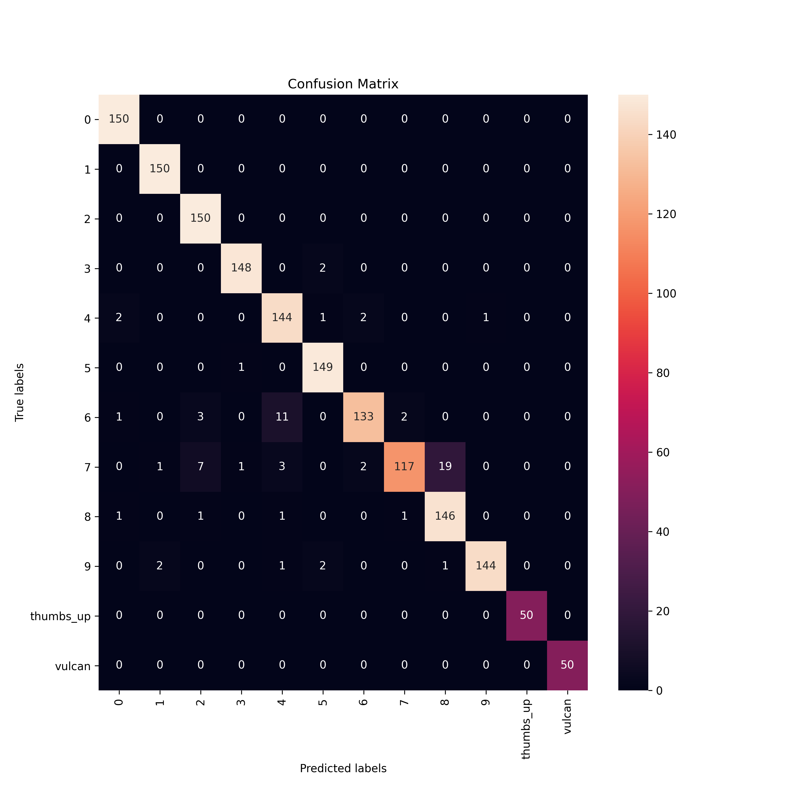

# All Hands on Deck: A Voyage of Hand Gesture Detection Using Machine Learning

## Overview

Hand gestures are universally used for communication in cultures and languages around the world. This project aims to detect common hand gestures such as for the digits 0 through 9 represented on one hand. The aim is to correctly identify the hand gestures using image classification and then use a live tracking library to track hands moving on a live webcam feed by object detection.

## Contents

- [Dataset](#Dataset)
- [Questions](#Questions)
- [Objectives](#Objectives)
- [Exploration](#Exploration)
- [Modeling](#Modeling)
- [Analysis](#Analysis)
- [Summary](#Summary)
- [Discussion](#Discussion)

# Dataset

- [Dataset Source](https://www.kaggle.com/muhammadkhalid/sign-language-for-numbers/version/1)
- Total classes = 10 (the digits 0 through 9 represented on one hand
- Total images = 10 \* 1500 = 15000
- Each class has 1500 images
- Added two extra hand gestures with 500 images each

  - thumbs up
  - vulcan salute (from Star Trek)

    

    

# Questions

- Can a machine accurately predict and distinguish different hand gestures from an image?
- What applications with image classification and object detection and hand gesture can be applied for business or practical use cases?

# Objectives

- Identify and classify hand gestures correctly by image class
- Utilize transfer learning on the original MobileNet convolutional neural networkmodel
- Evaluate the model performance for accuracy and loss

# Exploration

- The original dataset are images of hand gestures in regular RGB colored format.
- We preprocess the data using grayscale and reformat the images to a target size of 224 by 224 for height and width.

# Modeling

# Analysis

# Summary

The transfer learning model that was retrained from the original MobileNet convolutional neural network model performed quickly and efficiently on the new data with the new target feature labels of hand gestures. When training over 40 epochs, we see that the model performance for the loss and accuracy begin to stabilize at around the 20th epoch mark. This indicates the speed and accuracy from the transfer learning model applied to the hand gestures dataset when retraining the model.

In terms of the confusion matrix, the new model accurately predicts most of the hand gesture digits 0 through 9. However, the model seems to have some difficulty with distinguishing between the hand gesture for the digit 7 and the digit 6. Of the 150 test images, the model predicted the hand gesture of 11 images to be for the digit 4, when the true label was in fact the hand gesture for digit 6. Similarly, of the 150 test images, the model predicted the hand gesture of 19 images to be for the digit 8, when the true label was in fact the hand digit 7.

The two additional hand gestures for "thumbs up" and vulcan salute" performed well with the model predicting 50 out of 50 test images being the correct true label.

Overall, the retrained CNN model using transfer learning does a fairly good job at predicting the correct hand gesture given these 12 image classes.

# Discussion

- How can we utilize a single-board computer such as a Raspberry Pi to detect hand gestures?
- How can restaurants or small businesses utilize the hand gesture detection model in their day-to-day operations?
- What is the best way that restaurant or small business review platforms like Yelp can utilize this "hands-only" approach to giving sentiment or numerical feedback for ratings?

